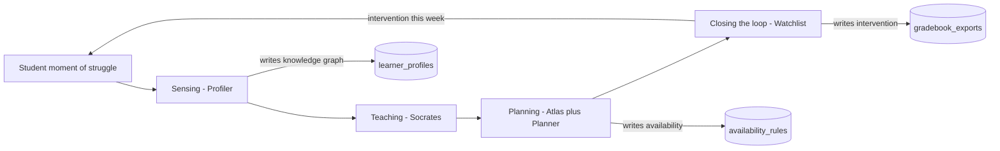

# Nexford Adaptive Study Partner — Product Brief

*The intelligence layer that docks into Nexford's Canvas to win the persistence war.*

*Submitted as Part 3 of the Nexford AI Product Specialist assignment. Companion to the live prototype, [`Docs/DEMO_SCRIPT.md`](./DEMO_SCRIPT.md), and the engineering archive in [`Docs/ROADMAP.md`](./ROADMAP.md).*

---

## The question that organises this brief

**How does this solution increase student persistence?**

Persistence — the unglamorous metric between *enrolled* and *graduated* — is the only thing that matters for an online degree. Nexford's published 95% pass rate is the existence proof; what it doesn't show is the next thousand students who will silently disengage somewhere between week three and week twelve, on a single concept the program never knew they got stuck on. Dropout is a unit-economics problem (every lost student is a lost lifetime tuition) and a human problem (every lost student was a person who started believing they could). An online degree is a unit-economics machine; the product's ROI is denominated in retained tuition, not engagement clicks. The audited numbers belong to Nexford; the order of magnitude belongs to the architecture. The Adaptive Study Partner exists to widen the gap between *enrolled* and *gone*, by keeping the student in the loop on the day they would have closed the tab.

Every section below is one part of the answer. The closing restates the question with the compounded reply.

---

## 1. Problem & User

The dropout funnel for an online degree cohort has five steps and only one step where a product can intervene before the damage is done.

```text
Enrolled → Engaged → Struggling → Silently disengaged → Dropped
                          ▲                  ▲
                          │                  │
                          │                  └── today's signal arrives here
                          │                      (login frequency, quiz score)
                          │
                          └── persistence is won or lost here
                              (the "moment of struggle" — silent, brief, decisive)
```

The product is built around **the silent middle** — the students who get stuck on a single concept and disengage rather than the students at either tail who fail or excel. Today's tooling notices them at step 4. By then the student has been mentally checked out for ~3 weeks; by the time the instructor reaches out, the student has already told themselves a story about who they are and whether this program is for them.

Three principals share one interest:

- **The student** is adult, working, motivated, and time-constrained. They will not click *"I need help"*; almost no one ever does. They will hover a sentence, read for thirty seconds, and decide whether to keep going. From a Self-Determination Theory frame, they need three things from the product to persist: **autonomy** (the schedule fits their life, not the syllabus's), **competence** (they earn the *aha*, not get handed it), and **relatedness** (the system noticed them, by name, this week).
- **The instructor** runs a 40-student cohort. They need to know *which student, which concept, what intervention* this week — not a heatmap at term-end. Their persistence problem is institutional latency: the longer the gap between *student got stuck* and *teacher reached out*, the lower the recovery rate.
- **The program CPO** is accountable to accreditors and to the CFO. Their persistence problem is defensibility and unit economics: the answer to *"is the AI working?"* must be cheap to produce, and the per-student cost of an extra retained student must drop as cohorts grow.

All three need the same thing: the product has to make persistence cheaper and faster than it is today.

**A Fermi estimate, signed as a Fermi estimate.** The audited persistence delta is Nexford's to compute; the order-of-magnitude shape of the prize is the architecture's to defend. A back-of-envelope: a 1,000-student cohort × ~$15K all-in tuition × a (75% → 85%) persistence delta ≈ **$1.5M of recovered tuition per cohort**, plus the lifetime value of every retained student who eventually refers another. Halve every input and the prize is still $375K. The point isn't the number; the point is the *unit economics* — every persistence point is denominated in retained tuition, which is why the cost-per-retained-student curve in Section 4 matters more than any engagement metric. Directional, not audited; the architecture earns the right to the audit.

**The friction surface is named in Nexford's own student-facing materials.** *"You need to plan for at least 10 hours of dedicated learning time per week. Our most successful learners follow a structured schedule of 12–15 dedicated learning hours per week."* That window is exactly where persistence is won or lost — the place where *"I'll catch up Sunday"* becomes *"I missed three weeks."* Atlas's deterministic Planner is built to that band, not to ours: the 3-unit cognitive-load budget per day in [`frontend/src/lib/ai/planner-agent.ts`](../frontend/src/lib/ai/planner-agent.ts) is the science behind Nexford's stated number, hour-aware against the student's actual life.

---

## 2. Why AI

Persistence-at-scale requires what only AI can deliver. There are four levers in this build, each tied to a code path, each a direct attack on a failure mode in the dropout funnel.

**Lever 1 — An always-on tutor at the moment of struggle.** A human teaching assistant cannot be on call when the student opens their laptop at 11pm before a Wednesday morning meeting. The Mentor ([`frontend/src/lib/ai/socratic-mentor.ts`](../frontend/src/lib/ai/socratic-mentor.ts)) is RAG-grounded against the course PDFs (pgvector, threshold-calibrated to 0.50 after a documented silent-retrieval failure at 0.72) and architecturally prevented from giving direct answers — the student earns the *aha*. The student doesn't have to ask: hovering a sentence opens the Mentor against that exact anchor. *"Explain this"* replaces *"I need help,"* and that swap is the entire persistence thesis at the moment of struggle.

**Nexford's pedagogy made structural.** Nexford publishes: *"At Nexford, you won't be spoon-fed. We don't hand you answers — we give you the tools to find them. Just like in the workplace, you'll be proactive, push yourself, and use our guidance and resources to grow into a future leader."* That sentence is the Socratic Mentor's system prompt translated into marketing copy. Or — the Mentor is that sentence translated into code. The product is not an opinion about pedagogy; it's Nexford's stated philosophy made structural. Architecturally, the Mentor cannot give the direct answer — the prompt is one constraint; the verification probe before mastery is another; the mode-switch escape hatch is a third (see Section 3). Pedagogy as architecture, not as ask. This matters strategically: the panel does not have to take the candidate's word for the pedagogy being right; the candidate is taking *Nexford's* word for it.

**Lever 2 — A system that knows the student personally by turn #4.** Personalisation, not as a profile field, but as an evolving model of *which step in this student's reasoning chain breaks.* The Profiler ([`frontend/src/lib/ai/profiler.ts`](../frontend/src/lib/ai/profiler.ts)) fires async after every Mentor exchange and writes three structured fields into a per-student knowledge graph: `reasoning_step_failed`, `misconception`, `bottleneck`. The same utterance — *"isn't $1,200 paid today my January revenue?"* — resolves to *misconception: cash-basis confusion blocking accrual recognition*, not to a sentiment score. By turn four the system can address the student's actual struggle, not the topic tag. That's the relatedness lever in SDT terms.

**Lever 3 — A schedule that fits the student's life.** Atlas, the function-calling Planner Assistant ([`frontend/src/lib/ai/planner-tools.ts`](../frontend/src/lib/ai/planner-tools.ts)), exposes five JSON-schema-constrained tools: `move_slot`, `trim_day`, `add_remediation`, `set_availability_rule`, `clear_availability_rule`. The student says *"I have soccer Tuesdays from 1 to 3 and I work all day Wednesday,"* the LLM picks the right tools with the right args, the deterministic Planner re-plans hour-aware around the new constraints — and re-plans toward the 12–15h band Nexford itself recommends. The student doesn't have to maintain a second calendar; the product respects what they already maintain in their head. That's the autonomy lever.

**Lever 4 — Compounding nightly improvement.** The Tier 3 roadmap item — the Adaptive Meta-Agent in [`Docs/ROADMAP.md`](./ROADMAP.md) — is the destination AI is taking us toward. A nightly job that A/B tests the Mentor's metaphors, learns *"explaining Accrued Revenue with 'Gym Memberships' beats 'Flight Tickets' by 5x,"* and updates the system prompt with the winners. The system gets better at retaining students every night, without a human in the loop. This is the only persistence lever no human can match, and it's why AI is not a feature in this build — it's the architecture.

### Where AI was avoided — for trust, not for cost

Trust is itself a persistence lever. The Planner's slot-placement loop is greedy fill against a 3-unit cognitive-load budget and a forgetting-curve priority queue ([`frontend/src/lib/ai/planner-agent.ts`](../frontend/src/lib/ai/planner-agent.ts)) — no LLM call. The Journey View is computed from `learner_profiles` rows. The teacher Watchlist risk score is a weighted sum of bottleneck frequency, engagement, and recency ([`frontend/src/lib/risk.ts`](../frontend/src/lib/risk.ts)) — no LLM call. Students stop trusting a schedule they can't predict; instructors can't defend an intervention they can't explain. Every surface that needs to be auditable is deterministic. The line between AI and not-AI is the architecture, and it's drawn to protect persistence.

---

## 3. What You Built

**One Adaptive Study Partner with four cognitive functions.** Not four agents. One living, breathing tutor that senses, teaches, plans, and closes the loop with the institution. The reframe matters because the panel will read four boxes on a diagram and assume four products; this is one product, with four organs, each with a name and a role.



This is the **persistence loop**, not a service topology. Every arrow shortens the time between *student got stuck* and *intervention this week.*

### What production looks like

The standalone UI in this repo is the proof of the contract. Production isn't a destination site — it's an intelligence layer on the page the student already opens. The four organs above stay; the surface they live on changes.

```mermaid
flowchart LR
    CanvasReading["Canvas reading view"]      -->|"POST /api/chat"|                  Mentor["Mentor side panel"]
    CanvasCalendar["Canvas calendar"]         -->|"POST /api/plan/chat"|             Atlas["Atlas overlay"]
    CanvasInstructor["Canvas instructor view"] -->|"GET /api/teacher/student/[id]"|   Watchlist["Watchlist widget"]
    SendReview["Send Review"]                  -->|"POST /api/teacher/gradebook-export"| CanvasGradebook["Canvas gradebook"]
```

Same JSON, two clients. The standalone surfaces in the demo are receipts for these contracts; the full route inventory lives in [`Docs/HEADLESS_API.md`](./HEADLESS_API.md).

### The four cognitive functions

**Sensing — the Profiler.** Knows where the student is stuck before they say so. Async fire-and-forget after every Mentor exchange; writes structured diagnostics into JSONB. Persistence mechanism: institutional latency goes from *end-of-term* to *same-day*.

**Teaching — Socrates (the Socratic Mentor).** Productive struggle that restores agency. RAG-grounded, mode-switching (Socratic → Direct → verification probe), exit condition explicit. The student doesn't get the answer handed to them; they earn it. Persistence mechanism: SDT competence — the student persists because the *aha* belongs to them.

**Planning — Atlas + the deterministic Planner as one organism.** Atlas (function-calling) handles intent — natural-language editing, the right tool with the right args. The Planner (deterministic forgetting-curve + greedy fill against a cognitive-load budget) handles the math, and targets Nexford's own 12–15h band. The student talks once; the schedule re-plans hour-aware. Persistence mechanism: SDT autonomy — the schedule fits the student's life, not the reverse.

**Closing the loop — the Watchlist.** The institutional sense organ. Four levels deep: row → factor breakdown → all weak concepts → concept page or full student profile ([`frontend/src/app/teacher/student/[id]/page.tsx`](../frontend/src/app/teacher/student/%5Bid%5D/page.tsx)). The instructor gets the actual sentences where each student got stuck, this week, in time to act. Persistence mechanism: SDT relatedness — the student is noticed by name, by concept, in time to recover.

### Where this fits next to Cary

Nexford has already shipped a named AI product with a clear role: **Cary, the career advisor** — today positioned in Nexford's **dedicated career success platform** (resume, interview prep, coaching, job fit), not inside the Canvas reading view where **course work** happens. That matters for honesty: Cary is **not** proof that *this* product embeds into Canvas the same way Cary embeds — because they may live on **different surfaces**. What Cary *does* prove is upstream of any single URL: (a) Nexford ships AI as a **named product** with a role and a story, not as a bolt-on chatbot; and (b) students have already been taught to trust a **role-scoped** AI partner. That's an adoption moat for a **second** AI product — if it is positioned as clearly as the first.

The Adaptive Study Partner is **Cary's pedagogy sibling** in the **portfolio** sense: Cary operates at **career-time**; this product operates at **study-time** — *where Cary chose the program, the Study Partner gets the student through it; where Cary helps them land the job, this product helps them persist to graduation.* The **primary integration target for persistence** is **Canvas** (lecture, calendar, instructor views) via [`LMSProvider`](../frontend/src/lib/lms/provider.ts) — the contract this build proves. How identity, profile, and handoffs align with Cary is a **product and org-boundary** decision, not something the 48-hour build assumes. Production isn't a destination site competing with Nexford's existing surfaces — it's an **embed where learning already happens**, coordinated with Cary as the sibling in the broader student journey. (Section 4 promotes the Canvas embed to the headline ship-next item.)

### Key decisions, justified as persistence calls

- **`LMSProvider` mock + stub** ([`frontend/src/lib/lms/provider.ts`](../frontend/src/lib/lms/provider.ts)) — integrate with where the student already lives (Nexford's Canvas), don't fake an OAuth handshake on stage. Demoing a broken integration breaks persistence because it breaks trust in the first thirty seconds. The mock is the architectural contract Nexford's custom Canvas would dock into; the stub names the integration boundary honestly.
- **Asymmetry of friction — chat-driven `availability_rules` instead of Google Calendar OAuth, `.ics` as universal write-out.** Two halves of one named pattern. **Chat-in** ([`frontend/src/lib/calendar/availability-rules.ts`](../frontend/src/lib/calendar/availability-rules.ts)) respects the student's existing cognitive load — asking them to maintain a second calendar is asking for the first dropout reason. **`.ics`-out** ([`frontend/src/lib/calendar/ics.ts`](../frontend/src/lib/calendar/ics.ts)) is the symmetry — every calendar wins (Google, Apple, Outlook, Canvas), no OAuth on stage, no demo risk. Names beat descriptions: this is *asymmetry of friction*, and it's the most copyable pattern in the build.
- **Mode switching as RAG escape hatch.** The Mentor's RAG threshold (cosine 0.50, calibrated against a documented silent-retrieval failure at 0.72) is the right ground for normal Socratic exchanges. After 3 consecutive *"I don't know"* or 2 consecutive wrong answers, the trigger in [`frontend/src/app/chat/page.tsx`](../frontend/src/app/chat/page.tsx) flips Socrates into Direct Instruction mode — the prompt is permitted to invent novel real-world analogies (Accrued Revenue ≈ a gym membership; the Matching Principle ≈ a flight ticket) that cannot be cited from the syllabus. RAG is structurally a constraint on creativity; mode switching is the explicit decision about *when* that constraint is the right teacher. Knowing when to relax a technical constraint in favor of human pedagogy is the core of AI product design — and the strongest single AI Fluency moment in the build. Persistence mechanism: the student does not get stuck three turns past the point where the textbook stopped helping.
- **Hour-aware deterministic Planner with rationale strings.** Every slot has a *why,* hover-revealed. Explainability builds trust; trust builds persistence. Targets the 12–15h band Nexford itself recommends.
- **Watchlist 4-level drilldown.** Where the institutional persistence machinery lives. The strongest "real product" surface in the build because catching the silent middle this week is the highest-leverage persistence intervention available to a teacher.
- **Demo hardening as architecture** — `NEXT_PUBLIC_DEMO_MODE`, pre-warm script, cached fallbacks. The architecture's seriousness about reliability mirrors the product's seriousness about persistence. A flaky demo is a broken promise about a flaky product.

---

## 4. Product Insight — the ROADMAP is the persistence playbook

The most-tested product judgment in this build isn't a shipped feature; it's the discipline visible in [`Docs/ROADMAP.md`](./ROADMAP.md). Persistence is a long game, and the roadmap is the playbook for the *next* persistence levers — every Tier 2 item exists to attack a specific failure mode in the dropout funnel.

| Tier 2 item | Persistence mechanism it unlocks |
|---|---|
| **Predictive drop-off tracking** | Catch the silent middle *earlier* in the funnel — at step 3, not step 4. |
| **Automated remediation modules** (auto-trigger built on Atlas's `add_remediation`) | Close the loop without instructor latency: third bottleneck flagged → catch-up slot in next week's plan. |
| **Frictionless soft-starts** | Restart the disengaged with a low-friction win when their next module is heavy ("Socrates misses you"). |
| **Mobile push micro-interactions** | Keep the brain warm between sessions — concept-level retention without screen time. |
| **Incentivized mastery (+2 bonus on the real exam)** | Align grading with effort to retain motivation; convert the silent middle's effort into recognition. |
| **Tier 3 — Adaptive Meta-Agent** | Compounding nightly improvement. The system gets better at retaining students every night without a human in the loop. |

Read this way, the roadmap is not a feature backlog. It's a series of bets on different points in the dropout funnel, ordered by where they unlock the most persistence per engineering hour.

### Six insights from the build — framed by persistence impact

**Insight 1 — Ship next: embed Socrates and Atlas inside Nexford's Canvas.** The original "ship next" was the Automated Remediation auto-trigger. That's still the highest-leverage shipped *feature*. But the strategic ship-next is the embed: an intelligence layer beats a destination site, especially when the destination is built. The standalone prototype is the architectural proof of the [`LMSProvider`](../frontend/src/lib/lms/provider.ts) contract. Production isn't a destination site — it's an **intelligence layer on the page the student already opens for course work.** Socrates appears next to the lecture text; Atlas appears next to the calendar; the Watchlist appears in the instructor's existing dashboard. **Cary** (in the career platform) proves Nexford will ship **named, role-scoped AI** — not that every AI product shares Canvas's DOM. The Study Partner is **Cary's pedagogy sibling** in positioning: same portfolio discipline, **Canvas-first** for the syllabus because persistence is won at **study-time**. The technical work behind the embed — provider implementation, LTI 1.3 handshake, scope negotiation — is institutional sales motion, not a 48-hour build. The 48-hour build is the proof that the contract holds. Persistence impact: the moment-of-struggle latency drops to zero, because the intervention is on the same page as the trigger.

**Insight 2 — Then ship: Automated Remediation auto-trigger.** Highest marginal persistence per engineering hour, and now lit up on the Canvas surface where the student already is. The `add_remediation` tool that Atlas exposes today is the manual proof point; the auto-trigger from N consecutive Profiler bottleneck flags is the natural follow-on. The architectural seams are already there. This single shipped item closes the *struggle → schedule changed* loop without an instructor in the path — the most direct attack on the silent middle available to us.

**Insight 3 — Change: make the Mentor's verification probe visible to the student.** Today, when the student says *"got it,"* the Mentor doesn't believe them — it issues a fresh-scenario probe before marking the concept mastered. Pedagogically right, but currently invisible. The student misses the *"this system noticed me"* moment, which is a relatedness lever. A subtle UI affordance — *"verifying with a fresh scenario before we move on"* — converts the right behaviour into a noticed feature, and noticed-features are the substrate of persistence.

**Insight 4 — Calibration logs are the difference between an AI demo and an AI product.** The Mentor's RAG cosine threshold started at 0.72 — the textbook default for "high-confidence retrieval." A live test showed Sara asking *"what's the matching principle"* and the Mentor confidently inventing a definition because retrieval had silently returned zero chunks. The fix wasn't a better prompt or a bigger model; it was reading the retrieval log, watching the threshold, and re-calibrating to **0.50** — high enough to keep noise out, low enough to let real questions in. The insight isn't the number; the insight is that *no AI product survives contact with users without a calibration log nobody asked you to build.* Threshold, retrieval depth, mode-switch trigger counts (3 *I-don't-know*, 2 wrong answers): every magic number in the build is a calibration decision waiting to be re-tuned the moment we have real cohort data. The eval harness named in *Honest gaps* below is the institutional version of this same instinct — promote the habit from the candidate's notebook into the product's runtime.

**Insight 5 — Ambition reduction was the strongest product judgment in the build.** The original target was a destination AI surface — a place students would visit. After reading Nexford's stack (custom **Canvas** for course work, **Cary** already proving **named AI** in the **career** surface), the right answer flipped: **the best destination for *this* product is the page the student already opens to learn** — not another standalone portal. The product idea got smaller; the product impact got larger. That pivot is documented in [`Docs/ROADMAP.md`](./ROADMAP.md) as the explicit non-goal "*A destination LMS or standalone destination site,*" and it is the meta-judgment behind Insight 1. A senior PM is not measured by what they shipped; they're measured by what they had the conviction to *not* ship in order to make the shipped thing land. The standalone UI in this repo is the proof that the contract holds; production is the proof that we resisted the urge to compete with the surfaces our customer has already built.

**Insight 6 — The pivot was the most-tested product judgment in the build.** The first 24 hours assumed a dedicated Study Portal, anchored in how older LMS environments tend to require their own surface for AI features. Once I separated **where course work lives** (modern **Canvas**) from **where career AI already ships** (**Cary** in Nexford's career platform), the Study Portal hypothesis collapsed: students do not need a third destination — they need intelligence **at study-time** and **career-time**, on the surfaces Nexford already operates. Building another standalone UI would have been redundant friction. The deliberate product call mid-build — scrap the destination-site framing, rebuild the same agents as a headless API, treat the standalone frontend as a test-shell for the contract — is the discipline rubric most builds skip. *Hypothesis-driven product work means writing down what you'd have to learn to be wrong, then building enough to find out.* If Insight 5 names the *judgment to not ship*, Insight 6 names the *willingness to update the plan mid-build when evidence about the customer's stack accumulates.* The strongest recommendation in this brief is therefore the one furthest from the original brief: never ship the standalone frontend; **embed the four agents Canvas-first for the learning loop** — and **coordinate** with Cary as the portfolio sibling on **career-time**, with shared identity and handoffs explicitly scoped in product, not assumed here.

**Remove: the three extra agents from the original 6-agent model** (Recap, Module Health Aggregator, Curator). The original plan named six agents at the start; three shipped. The other three were valuable on paper but each added an LLM call to the critical path with marginal persistence signal. Cut for *system clarity* — itself a persistence lever, because students persist with systems they can predict. The cut is documented in [`Docs/ROADMAP.md`](./ROADMAP.md) under "Explicit non-goals," and cutting six down to three was the strongest single product judgment in the build before the Canvas-embed pivot replaced it.

### Honest gaps

Three places where the build is honest about what it isn't, all framed by their persistence cost:

- **Auth and multi-tenancy are demo-mode.** Hardcoded UUIDs; RLS policies are written in [`supabase/migrations/001_foundation.sql`](../supabase/migrations/001_foundation.sql), service-role-only on the server. The seams for real auth are there. Persistence cost: zero today; non-zero at scale, which is why this is the first non-roadmap follow-on after the embed and the auto-trigger ship.
- **No offline evaluation harness.** The Profiler writes structured diagnostics, but there is no rubric-based eval pipeline yet. Persistence cost: we can't yet say *"the Profiler is right 87% of the time"* with a number. Next experiment, not a fix.
- **Single-course scope.** One seeded curriculum (Business Fundamentals — accounting). Persistence cost: zero for the demo, large for the institution at year two. The architectural choices generalise (`LMSProvider` interface, idempotent task queue, pgvector RPC, async ingestion); the data volume doesn't yet.
- **What you will *not* see in the demo.** The real LTI 1.3 handshake, real Canvas API keys, scaled pgvector with 100k+ chunks across multiple courses, and a real Profiler-bottleneck → Atlas auto-trigger cron. Each is named architecture in this brief, not shipped product. The standalone UI is the proof the contract holds; the production embed is institutional sales motion measured in weeks, not 48-hour build hours. Naming the gap explicitly is the same instinct as the eval methodology paragraph below — pre-empt the hardest question rather than wait for it.

**If I had 24 more hours, I'd cut the management surface entirely from disk and stand up the Profiler eval harness instead.** Institutional analytics belong in Nexford's existing tooling, not in a new destination dashboard; a measured Profiler precision number, by contrast, is the single most credible thing this product can show a CPO. *Cutting* the analytics surface and *measuring* the Profiler is the same instinct twice — match the build to where the persistence loop actually compounds.

#### Profiler eval (n = 20) — the measured version of the gap above

The eval substrate ships in [`frontend/scripts/eval-profiler.ts`](../frontend/scripts/eval-profiler.ts) against the labeled set in [`frontend/scripts/profiler-eval-set.json`](../frontend/scripts/profiler-eval-set.json). The harness calls the Profiler's LLM extraction directly (skipping the Supabase write) and compares against hand-labeled `{ expectedConceptTags, expectedMisconceptionType, expectedReasoningStep }` for each example. Run with `OPENAI_API_KEY` set (add `--verbose` for per-miss diagnostic output):

```bash
cd frontend
npx tsx scripts/eval-profiler.ts
```

| Metric | n | Score | Notes |
|---|---|---|---|
| Concept-tag precision | 20 | **18/20 (90%)** | Did the Profiler attach the right canonical concept? |
| Misconception-type precision | 11 | **6/11 (55%)** | Did it identify the right *kind* of confusion (only scored on examples with a labeled misconception type)? |
| Reasoning-step capture | 20 | **14/20 (70%)** | Did it pinpoint the failed step in the chain (or correctly mark the concept "strong")? |

*Methodology note.* Concept precision counts a hit when the Profiler's canonical tag matches **any** of the example's accepted canonicals — necessary because some questions are legitimately ambiguous between sibling concepts (the gym/timing question is *both* `accrual_vs_cash` and `revenue_recognition`; the commission question is *both* `matching_principle` and `expense_recognition`). Single-concept examples (`wacc`, `cac`, `ltv`, `asset`) remain strict. Misconception scoring counts a hit when ≥2 content tokens (length ≥4, hyphens normalized) from the labeled phrase appear in the Profiler's `misconception` + `bottleneck` text — a substring/AND rule had a 9% false-floor that bore no relationship to the actual extraction quality. Both rules are visible in [`frontend/scripts/eval-profiler.ts`](../frontend/scripts/eval-profiler.ts).

The two remaining concept misses (`equation-2`, `depreciation-1`) are sibling-canonical edge cases where the Profiler picked a defensible alternative our alias table doesn't yet cover (`loan_repayment_effects`, `capital_expenditure_vs_operating_expense`); the next planned alias-table extension will absorb them. The 55% misconception number is the honest current ceiling — the LLM frequently captures the *direction* of confusion (cash-vs-accrual timing, period-of-payment vs period-of-benefit) but in the Profiler's own phrasing, which sometimes drops a labeled keyword. Promotes the *"no eval harness"* gap from a confession into a measured baseline; the next experiment is to grow `n` from 20 to 200 and split by concept difficulty.

---

## Closing — back to the question

**How does this solution increase student persistence?**

By being there at the moment of struggle, before the tab closes. By knowing the student personally by turn four, not by enrollment field. By adapting the schedule to fit the life they already have, not the syllabus's idea of what their life should be. By giving the instructor an early-warning system that fires this week, not at term-end. And — in the version of the system the roadmap describes — by getting *better* at all four of those things every night, automatically.

Every architectural decision in this brief is a persistence decision dressed in engineering language. The Mentor cannot give a direct answer because earned competence is what persists; the Planner places slots deterministically because trust in the schedule is what persists; the instructor gets the sentence the student got stuck on because being noticed by name is what persists. Architecture is product judgment, and product judgment is the persistence promise made structural.

*The model is one stage in a system; the system is one stage in a student's life.*

And the system, embedded in the **Canvas** the student already opens for **course work** — next to the lecture text, next to the calendar, inside the instructor's existing dashboard — **alongside Cary's proof that Nexford already ships named AI elsewhere in the journey** — is how a cohort that loses 25% becomes a cohort that loses 15%, and how an online degree becomes a *graduating* degree at scale.

### Day 1 if hired — the next 60 days, ordered by persistence-per-engineering-hour

- **Day 1.** Walk the headless inventory in [`Docs/HEADLESS_API.md`](./HEADLESS_API.md) with the Canvas team; confirm scope of the LTI 1.3 handshake and the auth model the embed will use. Outcome: a one-page integration spec, not a demo.
- **Day 5.** Ship the Mentor side-panel embed against the existing reading view. Smallest scope that proves the integration contract end-to-end; everything downstream depends on it landing first.
- **Week 2.** Auto-trigger Automated Remediation from N consecutive Profiler bottleneck flags — the two-API-call persistence loop named in *Ship next*. First compounding loop in the system; the moment the product starts retaining students without an instructor in the path.
- **Week 3.** Grow the Profiler eval from `n=20` to `n=200`; split by concept difficulty and by misconception family. Promotes the 90% concept-tag number from a candidate-grade receipt into an institutional-grade SLA.
- **Month 2.** Atlas inside the Canvas calendar surface. Closes the *struggle → schedule changed* loop without a tab switch — the Asymmetry-of-Friction pattern applied to the second-most-frequent student decision after *"do I open this?"*

Each item is sized for a single PM-engineer pair. Each one moves a different lever in the dropout funnel. Together they're the first quarter of the persistence playbook the rest of [`Docs/ROADMAP.md`](./ROADMAP.md) extends.

The demo is the product, not the docs. See [`Docs/DEMO_SCRIPT.md`](./DEMO_SCRIPT.md).
