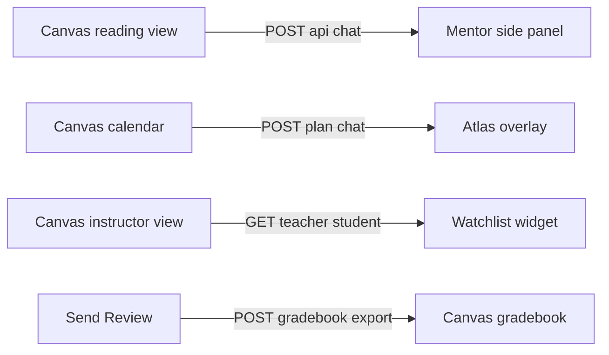

# Nexford Adaptive Study Partner — One-Pager

*[Download as PDF](https://github.com/Joelwillfors/nexford-adaptive-study-partner/blob/main/Docs/PRODUCT_BRIEF_ONE_PAGER.pdf) for offline / iPad reading.*

*The intelligence layer that docks into Nexford's Canvas to win the persistence war.*

*90-second CPO memo. Long-form: [`Docs/PRODUCT_BRIEF.md`](https://github.com/Joelwillfors/nexford-adaptive-study-partner/blob/main/Docs/PRODUCT_BRIEF.md). Live prototype: [nexford-adaptive-study-partner.vercel.app](https://nexford-adaptive-study-partner.vercel.app/).*

---

**How does this solution increase student persistence?** An online degree is a unit-economics machine; every percentage point of cohort persistence is recovered lifetime tuition. Persistence is won or lost in the **silent middle of the cohort** — the students who get stuck on a single concept and disengage rather than fail or excel. Today the program sees the result three weeks late (login frequency, quiz score). The wedge is the **moment of struggle** — silent, brief, decisive — and the build is organised around being there when it happens.

## Problem

Three principals share one metric. The **student** needs autonomy (the schedule fits their life), competence (they earn the *aha*), relatedness (the system noticed them). The **instructor** needs *which student, which concept, what intervention* this week, not at term-end. The **CPO** needs persistence to be defensible and cheap to scale. Nexford's own materials anchor the friction surface: 10 hours/week is the floor; 12–15 is what successful students sustain — exactly where *"I'll catch up Sunday"* becomes *"I missed three weeks,"* and the band Atlas's deterministic Planner ([`planner-agent.ts`](https://github.com/Joelwillfors/nexford-adaptive-study-partner/blob/main/frontend/src/lib/ai/planner-agent.ts)) is built to hold.

## Why AI — four persistence levers, each tied to a code path

- **Always-on tutor at the moment of struggle** — Socratic Mentor (RAG, GPT-4o, threshold-calibrated 0.50 after a documented silent-retrieval failure at 0.72). *"Explain this"* hover replaces the *"I need help"* click no one ever clicks.
- **A system that knows the student personally by turn #4** — the Profiler writes `reasoning_step_failed` / `misconception` / `bottleneck` into a per-student knowledge graph. SDT relatedness.
- **A schedule that fits the student's life** — Atlas, function-calling, exposes five tools (`set_availability_rule`, `move_slot`, `add_remediation`, `trim_day`, `clear_availability_rule`); deterministic Planner re-plans hour-aware against the 12–15h band. Autonomy.
- **Compounding nightly improvement** — Tier 3 Adaptive Meta-Agent in [`Docs/ROADMAP.md`](https://github.com/Joelwillfors/nexford-adaptive-study-partner/blob/main/Docs/ROADMAP.md): a system that gets better at retaining students every night.

Nexford's pedagogy — *"we don't hand you answers"* — is the Mentor's system prompt as marketing copy. Pedagogy as architecture, not as ask. **Where AI was avoided** — slot placement, risk score, Journey View — is deterministic for trust, not cost. Trust is itself a persistence lever.

## What I built — one Adaptive Study Partner, four cognitive functions

- **Sensing — the Profiler.** Async pass after every Mentor exchange; structured diagnostics into JSONB.
- **Teaching — Socrates.** RAG-grounded, mode-switching, exit-condition explicit. Productive struggle, never the answer.
- **Planning — Atlas + the deterministic Planner.** Atlas handles intent; Planner handles math against Nexford's 12–15h band.
- **Closing the loop — the Watchlist.** Four-level drilldown turns silent struggle into intervention this week.

**Cary's pedagogy sibling (portfolio sense).** Cary lives in Nexford's **career success** surface — resume, coaching, job fit — not in the Canvas reading view. Cary still proves **named, role-scoped AI** works at Nexford; it does **not** prove this product embeds the same way. **Study-time** persistence lands **Canvas-first** (lecture, calendar, instructor) via [`LMSProvider`](https://github.com/Joelwillfors/nexford-adaptive-study-partner/blob/main/frontend/src/lib/lms/provider.ts). *Where Cary chose the program, the Study Partner gets the student through it.* Shared identity with Cary is a roadmap decision, not assumed in this build.

The four highest-leverage decisions, all justified as persistence calls:

1. **Asymmetry of friction.** Chat-in / `.ics`-out. Maintaining a second calendar is the first dropout reason; live OAuth on stage is the worst-possible demo failure mode.
2. **`LMSProvider` mock + stub instead of fake Canvas.** *Send Review* writes idempotently to a real `gradebook_exports` table — same demo time as a fake button, three times the credibility.
3. **Watchlist 4-level drilldown.** Row → factor breakdown → all weak concepts → concept page or full student profile. Catches the silent middle this week.
4. **Mode switching as RAG escape hatch.** After 3 *I-don't-know* or 2 wrong answers, Socrates flips into Direct Instruction — permitted to invent novel analogies (Accrued Revenue ≈ a gym membership) the syllabus doesn't contain. Knowing when to relax a technical constraint in favor of human pedagogy is the AI product judgment most builds get wrong.

## Why this works — the persistence science

- **Calibrated confidence (Dunlosky, 2013).** The predictable dropout is the *confidently wrong* student. Mastery is gated on probe-correct **and** confidence ≠ guessing — not just a right answer — in [`handleQuizResponse`](https://github.com/Joelwillfors/nexford-adaptive-study-partner/blob/main/frontend/src/app/api/chat/route.ts). Completion is the wrong metric; calibration is.
- **Spacing + load + interleaving (Ebbinghaus; Sweller; Bjork).** The #1 qualitative dropout complaint is *"I don't know how to schedule this."* The Planner is deterministic, forgetting-curve-weighted, load-budgeted at 3 units/day, and deliberately interleaved — [`planner-agent.ts`](https://github.com/Joelwillfors/nexford-adaptive-study-partner/blob/main/frontend/src/lib/ai/planner-agent.ts). A schedule students trust is a schedule they follow.

## What I learned

**Insight 1 — Architecture is product judgment (the deterministic divide).** LLMs negotiate intent; deterministic code executes math. Trust in the schedule equals persistence in the course.

**Insight 2 — Restraint as a feature.** Six agents shipped down to three; live OAuth shipped down to `.ics`. Students persist with systems they can predict.

**Insight 3 — Calibration logs are the difference between an AI demo and an AI product.** The Mentor's RAG threshold (0.72 → 0.50) is the receipt. No AI product survives contact with users without a calibration log nobody asked you to build.

**Insight 4 — The pivot was the strongest product judgment in the build.** First 24 hours assumed a dedicated Study Portal. Reading the stack — **Canvas for course work**, **Cary for career AI** — collapsed the assumption: another destination site was redundant. Mid-build call: scrap the destination, rebuild as a headless API, treat the standalone UI as a test-shell for the contract. The product idea got smaller; the persistence impact got larger. (Operationalised in *Ship next* below.)

## What production looks like

Same JSON, two clients. Standalone surfaces in the demo are receipts for these contracts; full route inventory in [`Docs/HEADLESS_API.md`](https://github.com/Joelwillfors/nexford-adaptive-study-partner/blob/main/Docs/HEADLESS_API.md).

## Ship next — embed inside the Canvas the student already opens

Production isn't a destination site — it's an **intelligence layer on the page the student already opens.** Socrates next to the lecture text; Atlas next to the calendar; Watchlist inside the instructor's existing dashboard. The 48-hour build is the proof the contract holds; LTI 1.3 + scope negotiation is institutional sales motion, not engineering scope.

**Right after the embed lands — Automated Remediation auto-trigger:** Atlas's `add_remediation` plus the Profiler's bottleneck flags is two API calls and a cron job from the first *compounding* persistence loop in the system.

**On the horizon — the Adaptive Meta-Agent (Tier 3, [`Docs/ROADMAP.md`](https://github.com/Joelwillfors/nexford-adaptive-study-partner/blob/main/Docs/ROADMAP.md)):** a nightly job that A/B tests Mentor metaphors, learns which framings retain students, and updates the system prompt with the winners. The system that gets better at retaining students every night, without a human in the loop. This is the destination AI is taking us toward, and it is roadmap — never a Q2 commitment.

## Closing

By being there at the moment of struggle, before the tab closes. By knowing the student personally by turn four. By adapting the schedule to fit the life they already have. By giving the instructor an early-warning system that fires this week. And — in the version the roadmap describes — by getting *better* at all four every night, automatically. *The model is one stage in a system; the system is one stage in a student's life.* Embedded in the Canvas the student already opens, this is how a cohort that loses 25% becomes a cohort that loses 15%.
